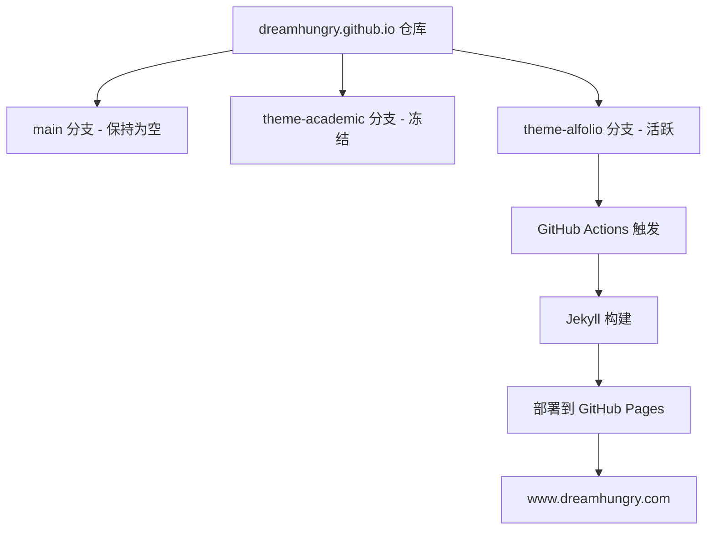

## 用户需求

将个人主页仓库 `dreamhungry.github.io` 引入 al-folio 模板，作为新的 `theme-alfolio` 分支，实现独立部署。

## 产品概述

在现有 GitHub Pages 仓库中创建新分支 `theme-alfolio`，引入 al-folio 学术主页模板代码，配置好域名和基本站点信息，设置 GitHub Actions 自动部署，使该分支可以作为网站的部署源。

## 核心功能

- 创建 `theme-alfolio` 分支（orphan 分支，干净起点）
- 引入 al-folio 模板完整代码
- 配置自定义域名 `www.dreamhungry.com`（CNAME）
- 修改 `_config.yml` 中的 url、baseurl、仓库地址等基本配置
- 配置 GitHub Actions 部署 workflow，确保推送后自动构建并发布到 GitHub Pages
- 保留 `theme-academic` 分支不做改动（冻结）

## Tech Stack

- **静态网站生成器**: Jekyll（al-folio 模板内置）
- **部署平台**: GitHub Pages + GitHub Actions
- **模板**: al-folio（https://github.com/alshedivat/al-folio）
- **版本控制**: Git 分支管理

## Implementation Approach

### 策略

通过 `git remote add` 将 al-folio 仓库添加为远程源，在本地创建 orphan 分支 `theme-alfolio`，然后将 al-folio 的最新 release/main 分支内容拉入，再进行必要的配置修改。

### 关键技术决策

1. **使用 orphan 分支** — 与 main/theme-academic 没有历史关联，保持分支干净独立
2. **通过 git remote 引入模板** — 比下载 zip 更方便后续跟踪 al-folio 上游更新（`git fetch al-folio` 即可）
3. **GitHub Actions 部署** — al-folio 自带 `.github/workflows/deploy.yml`，需要在 GitHub 仓库 Settings 中将 Pages Source 设为 GitHub Actions，并将部署分支指向 `theme-alfolio`

### 部署配置要点

- `_config.yml` 中 `url` 设为 `https://www.dreamhungry.com`
- `baseurl` 留空（因为是顶级域名部署）
- 仓库 Settings -> Pages -> Source 选择 "GitHub Actions"
- 仓库 Settings -> Actions -> General -> Workflow permissions 开启读写权限

## Implementation Notes

1. **al-folio 的 deploy workflow 可能默认监听 main/master 分支的 push 事件**，需要修改 `.github/workflows/deploy.yml` 中的 `on.push.branches` 为 `theme-alfolio`
2. **CNAME 文件必须保留**，内容为 `www.dreamhungry.com`，否则自定义域名会丢失
3. **不要修改 main 分支**，所有操作在 `theme-alfolio` 分支进行
4. **al-folio 有 Gemfile.lock**，GitHub Actions 会自动安装依赖，本地无需 Ruby 环境

## Architecture Design



## Directory Structure

以下是 `theme-alfolio` 分支中需要关注和修改的文件：

```
theme-alfolio 分支根目录/
├── .github/
│   └── workflows/
│       └── deploy.yml          # [MODIFY] 修改触发分支为 theme-alfolio
├── _config.yml                 # [MODIFY] 修改 url、title、repository 等站点基本信息
├── _data/
│   ├── cv.yml                  # [MODIFY] 后续填写个人简历数据
│   └── repositories.yml        # [MODIFY] 后续配置 GitHub 仓库展示
├── _pages/
│   └── about.md                # [MODIFY] 后续填写个人介绍（首页）
├── _posts/                     # 博客文章目录（后续添加）
├── _projects/                  # 项目展示目录（后续添加）
├── _bibliography/
│   └── papers.bib              # 论文 bib 文件（后续添加）
├── assets/
│   └── img/                    # 图片资源目录
├── CNAME                       # [MODIFY] 确保内容为 www.dreamhungry.com
├── Gemfile                     # Ruby 依赖定义（保持不动）
└── Gemfile.lock                # 依赖锁定（保持不动）
```

## Agent Extensions

### SubAgent

- **code-explorer**
- Purpose: 在执行阶段如需确认 al-folio 模板的具体文件内容或 workflow 配置，可用于快速探索分支内容
- Expected outcome: 准确定位需要修改的配置项和文件路径